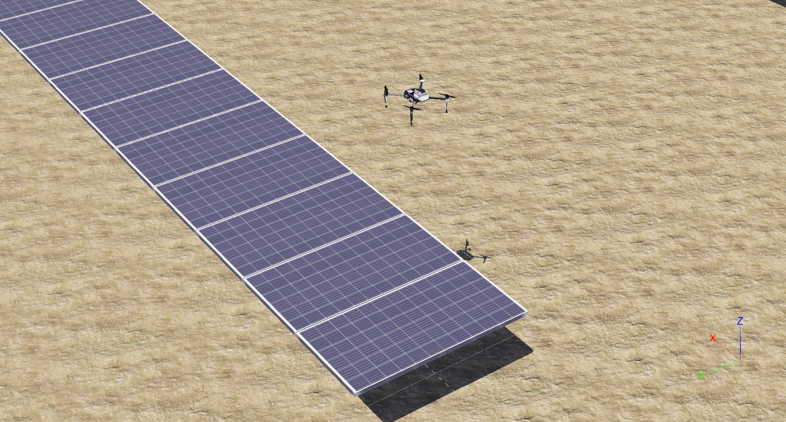

# Robotic Systems Simulated in Webots

<p float="left">
    
 </p>

<p float="left">
    
 </p>

<p float="left">
    
 </p>

## Dependencies

This simulator was developed using Webots [2023a](https://github.com/cyberbotics/webots/releases/download/R2023a/webots_2023a_amd64.deb). Additionally, the ROS version is Noetic, which can be downloaded from [Noetic](https://wiki.ros.org/noetic/Installation/Ubuntu).

The developed package has the following dependencies, which must be included in the ROS working space: [webots_ros](https://github.com/cyberbotics/webots_ros.git) and [ackermann_msgs](https://github.com/ros-drivers/ackermann_msgs.git).

Finally, the project includes an installation file to include all necessary dependencies for Python and ROS, defined as follows:

```bash
chmod +x install_python.sh
./install_python.sh
```

The WEBOTS_HOME environment variable must be set to the installation folder of Webots.

```bash
export WEBOTS_HOME=/usr/local/webots
```

## Ros Workspace
Create the following ROS workspace

```bash
mkdir -p ~/catkin_ws/src
cd ~/catkin_ws/
```
Inside the ROS workspace /src must be included:
[webots_ros](https://github.com/cyberbotics/webots_ros.git) and [ackermann_msgs](https://github.com/ros-drivers/ackermann_msgs.git).

Due to the python3 is necessary to configure the catkin workspace as follows:


```bash
catkin_make -DPYTHON_EXECUTABLE=/usr/bin/python3
```
 Before continuing source your new setup.*sh file:

```bash
source devel/setup.bash
```

## Blue Robot
To run the simulator using Blue Robot, execute the following command:
```bash
roslaunch blue_simulator simulator_webots.launch
```

## Photovoltaic Array Inspection
To run the simulator considering photovoltaic arrays and aerial vehicle, execute the following command:
```bash
roslaunch blue_simulator  thermal.launch
```

## Robot Manipulator
To run the simulator considering a 6 DOF manipulator robot  (DOBOT CR3), execute the following command:
```bash
roslaunch blue_simulator cr3_simulation.launch
```

## Docker
To facilitate the installation and use of the simulator, it can be built with a docker with the following instructions
### Clone the repository
```
mkdir ~/webot-blue
cd ~/webot-blue/
git clone https://github.com/lfrecalde1/blue_simulator.git
cd ~/webot-blue/blue_simulator
```
### Build the docker image
```
sudo docker build -t webots-blue . 
```
### Run the container
```
sudo docker run --shm-size=1g --ulimit memlock=-1 --ulimit stack=67108864 --rm -it --net=host -e DISPLAY=$DISPLAY --user=$(id -u $USER):$(id -g $USER) --name webots-blue-container --gpus all --cpuset-cpus="0-2" webots-blue
```
### Note: 
- The docker image is based from nvidia/cuda:11.8.0-base-ubuntu20.04. It also has Webots R2023a and ROS Noetic.
- When launching the container, it is specified that all graphics and 3 cpu cores will be used.
